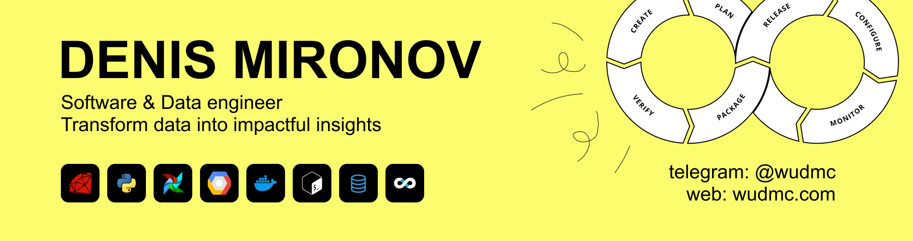

  <h1>Hi, I'm Denis!</h1>

🚀 Data Engineer specializing in building data pipelines for BI analytics! I transform data from any sources—databases/web scraping/parsing messengers/APIs—into valuable insights ✨📊 

**Is your startup ready to unlock data's potential?** Reach out to me on [Telegram](https://t.me/wudmc)! Together, we'll build scalable, cost-effective pipelines on Google Cloud's free tier, ensuring low costs and high-impact insights.
  

  

  
---

### 💼 My non-NDA projects 

- **Telegram Jobs Parser**
  - **Description:** Parsing ~400 Telegram jobs channels to find the best 😎 offers: ELT pipeline loads the data into GCS => stages in BQ => DataMarts in BQ => simple Looker BI dashboard and AD HOCs to filter the results.
  - **Stack:** Python, Airflow, Google Cloud Storage, Google BigQuery, Looker.
  - **Repositories:** [ELT Airflow DAGs](https://github.com/WuDMC/ELT_DAGs_for_tg_jobs_parser) | [Telegram jobs parser module](https://github.com/WuDMC/tg_jobs_parser_module)
  - **Looker Dashboard:** [View Dashboard](https://lookerstudio.google.com/reporting/87cf00b3-86c9-4203-865b-54320c762bb6)
    

      
📊 Click here to view dashboard screenshot

      
    

    
    

      
📑 Todo list:

      <ul>
        <li>Add CI and auto tests (my bad ...it should have been done at the very first stage)</li>
        <li>Use Terraform and run the project with one button</li>
        <li>Simple ML model to classify vacancies from CHATS (not only dialogs like now)</li>
        <li>Create more useful dashboards</li>
        <li>Auto extraction to Google Sheets</li>
        <li>Deduplication</li>
        <li>Advanced ML model to parse vacancy parameters like region, salary</li>
      </ul>
    

- **Media Processor Bot**
  - **Description:** Experiments with Computer Vision and FFmpeg: A web app (in Cloud Run container) processes media files (audio conversion with FFmpeg, face detection with Google Cloud Vision) and loads them to Google Drive via API. The interface is a simple Telegram bot. 😊 Full CI/CD workflow from scratch.
  - **Stack:** Python, Flask, Google Cloud Vision, Cloud Run & Cloud Build, FFmpeg, Docker, GitHub Actions.
  - **Bot Link:** [Gdrive Saver Bot](https://t.me/gdrive_saver_bot)
  - **Repositories:** [Data processing microservice](https://github.com/WuDMC/data-processing-web-app) | [Telegram Bot](https://github.com/WuDMC/simple-tg-bot)
    
    

      
😲 Click here to see face detection examples in Telegram

      
    

- **Startpoint APP**
  - **Description:** A web app generating travel routes from any place you are. If you don't know where to go during your holidays, try it.
  - **Stack:** Python, Django, Ruby, Sinatra, JS, Google Geocoding, Geonames API.
  - **App Link:** [Startpoint APP](https://wudmc.com/startpoint.html)
  - **Repositories:** [Geonames microservice](https://github.com/WuDMC/geonames) | [Django website](https://github.com/WuDMC/wudmc.com)
    
    

      
🚞 Click here to see route examples GIF

      
    

---

### 📈 My Stats

